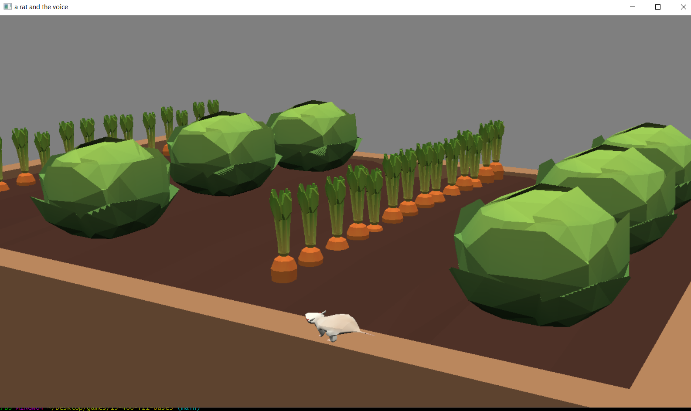

A rat and the voice

Author: Ruian Pan

Design: A random rat is chilling in the garden. All of a sudden he hears a command from a solemn voice. He follows the command and receives the ultimate reward(a compliment).

Screen Shot:

How To Play:

Use arrow keys to move the mouse, wasd to move the camera. When you hear the command from the voice, go to the row of veggies the voice specifies and he will give you a nice compliment.
The voice values effort a lot, so you have to go to a different row of veggies if you hear the same veggies twice. For instance, if you hear carrot twice, you must head left or right to another row the second time around.

Sources: 
Voiceacting done by me.

This game was built with [NEST](NEST.md).

